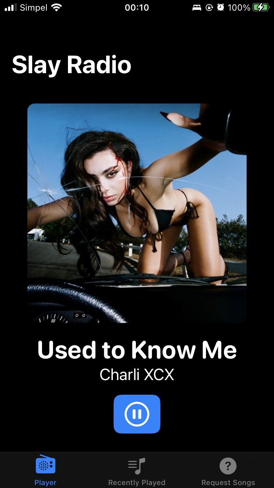

# SlayRadio
## A client app for AzuraCast built with SwiftUI

## Screenshots

| Home  | Recently Played | Requests |
| ----  | --------------- | -------- |
| |  | |

## Features (as of right now)
- [x] Play a radio station
- [x] A playback history view
- [x] iOS control centre playback controls
- [x] Request songs integration

## To add
- [ ] Multi station support
- [ ] Add your own station
    - Be able to add any AzuraCast instance
